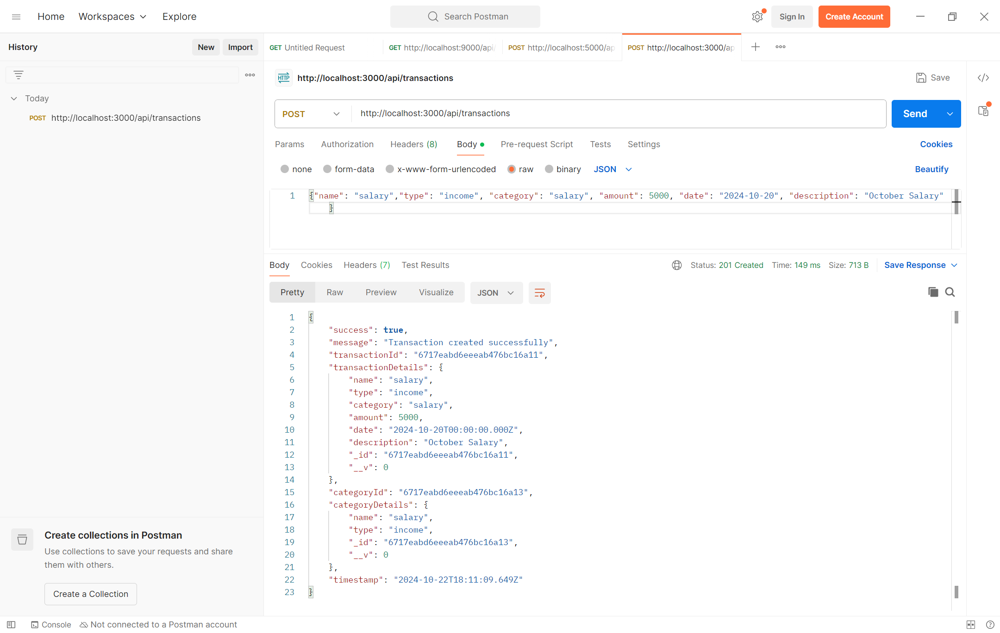
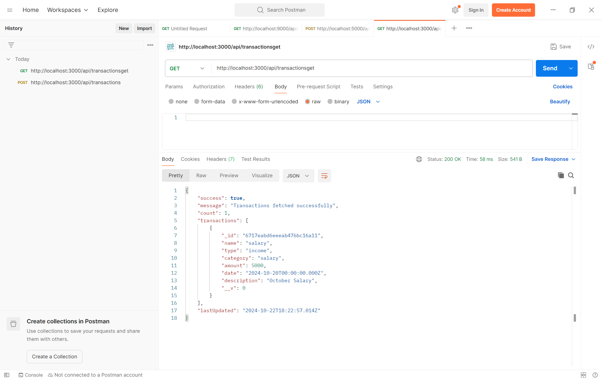
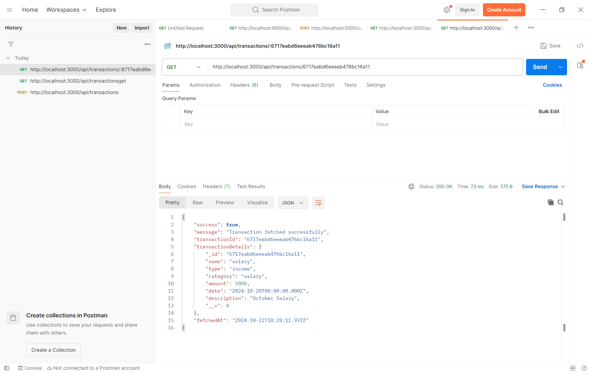
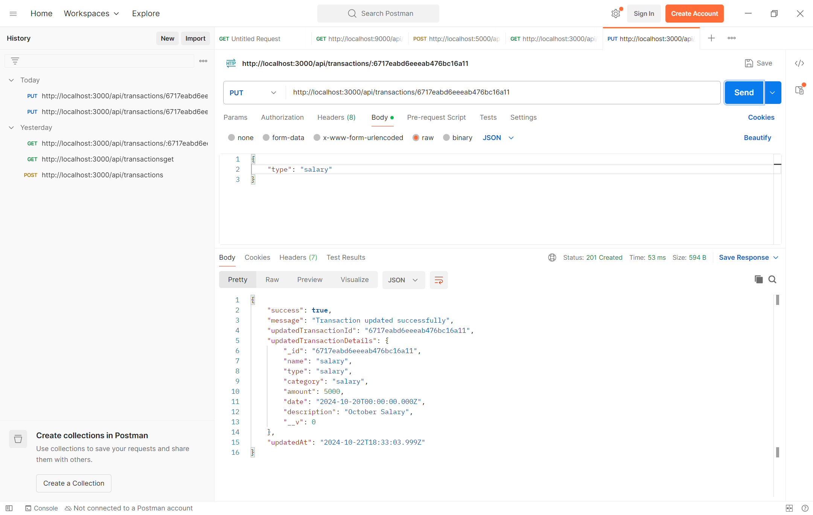
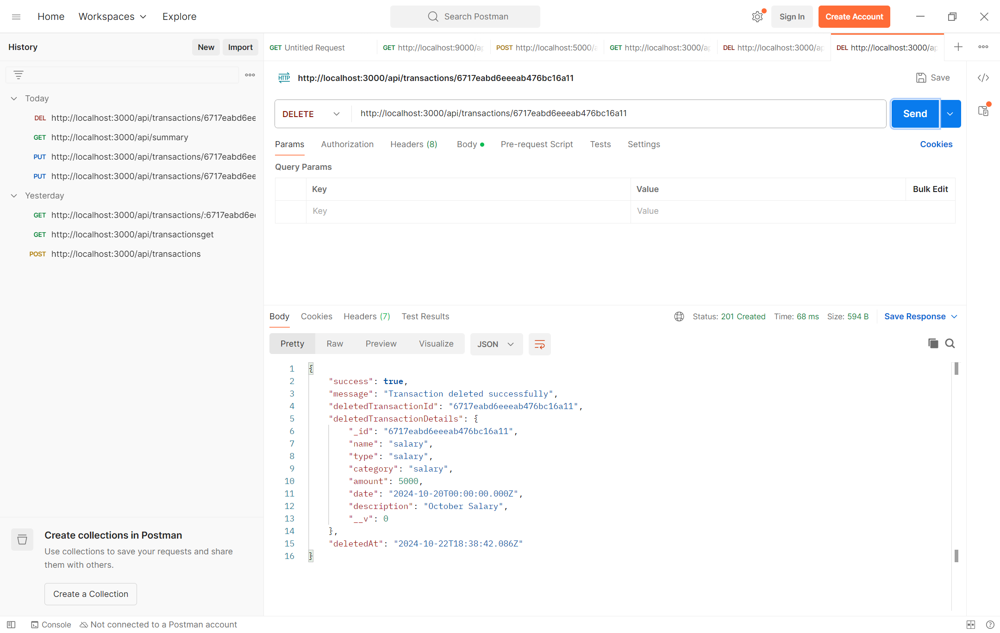
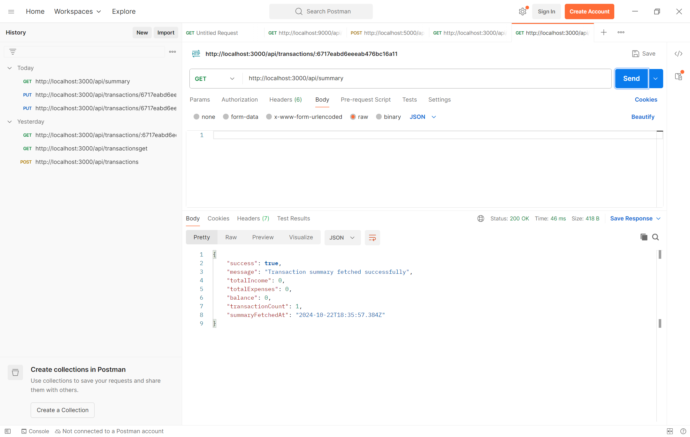

# [Floww.ai](http://Floww.ai) Node JS - Backend Assignment

### Assignment: Personal Expense Tracker

### Objective:
Develop a RESTful API for managing personal financial records. Users can record their income and expenses, retrieve past transactions, and get summaries by category or time period.

### Tools and Technologies:
- **Backend Framework**: Node.js with Express.js
- **Database**: MongoDB 

### Requirements:

1. **Database Setup**
    - I am using **MongoDB**, define the following collections:
        - `transactions`: { type, category, amount, date, description }
        - `categories`: { name, type }

2. **API Endpoints**
    - `POST /transactions`: Adds a new transaction (income or expense).
    - `GET /transactions`: Retrieves all transactions.
    - `GET /transactions/:id`: Retrieves a transaction by ID.
    - `PUT /transactions/:id`: Updates a transaction by ID.
    - `DELETE /transactions/:id`: Deletes a transaction by ID.
    - `GET /summary`: Retrieves a summary of transactions, such as total income, total expenses, and balance. Optionally, this can be filtered by date range or category.

3. **Functionality**
    - Implement route handlers for each endpoint.
    - Provide error handling to manage common issues like invalid transaction IDs, invalid inputs, etc.
    - Optionally add user authentication to protect the routes and associate transactions with specific users.


### Setup and Run Instructions:

1. **Clone the repository**:
    ```bash
    git clone https://github.com/your-repository-url.git
    cd your-repository
    ```

2. **Install dependencies**:
    ```bash
    npm install
    ```

3. **Configure database**:
    - For **MongoDB**, update your MongoDB URI in a `.env` file.

4. **Start the server**:
    ```bash
    npm start
    ```

5. **Test the API** using Postman or another API client.

### API Documentation:

- **POST /transactions**: Add a new transaction.
    - **Request**: `{"name": "salary","type": "income", "category": "salary", "amount": 5000, "date": "2024-10-20", "description": "October Salary" }`
    - **Response**: `201 Created`

**ScreenShot**


- **GET /transactionsget**: Get all transactions.
    - **Response**: `[ { "id": 1, "type": "income", "category": "salary", "amount": 5000, "date": "2024-10-20", "description": "October Salary" } ]`

    **ScreenShot**


- **GET /transactions/:id**: Get a transaction by ID.
    - **Response**: `{ "id": 1, "type": "income", "category": "salary", "amount": 5000, "date": "2024-10-20", "description": "October Salary" }`

 **ScreenShot**


- **PUT /transactions/:id**: Update a transaction by ID.
    - **Request**: `{ "type": "expense", "category": "food", "amount": 500 }`
    - **Response**: `200 OK`

**ScreenShot**


- **DELETE /transactions/:id**: Delete a transaction by ID.
    - **Response**: `204 No Content`

**ScreenShot**


- **GET /summary**: Get a summary of transactions, with optional filtering by category or date range.
    - **Response**: `{ "total_income": 5000, "total_expenses": 500, "balance": 4500 }`

**ScreenShot**


### Postman Screenshots:
Include screenshots of each API call demonstrating the expected behavior.
